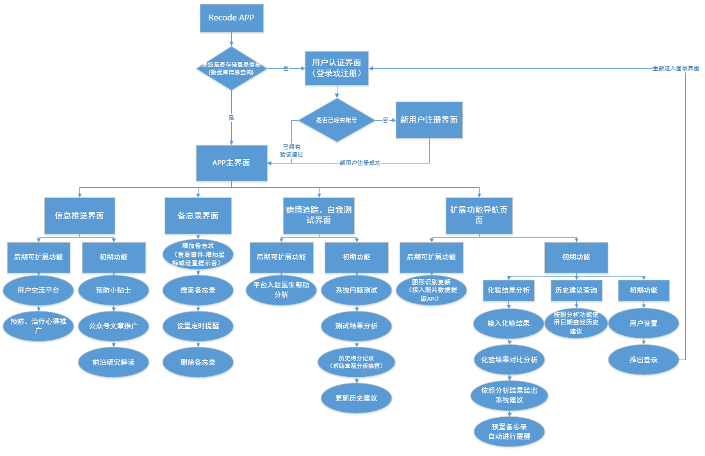

# Recode APP

## 1. 项目概述
Recode是一款服务于阿尔兹海默病人的看护家属或希望能预防阿尔兹海默病的用户的智能APP，可以针对不同需求的用户提供不同的服务。根据最新研究结果，帮助病人家属分析医院测试数据，并依结果给出具有针对性的建议，自动添加备忘录定时自动提醒，也可以根据个人需求自行增加提醒事项；病人家属可以根据病人近期表现情况填写系统预置病情测试题目，系统会根据结果分析病人病情，也会根据以往测试题目的情况绘制病情图，直观呈现同时给出相应建议。对于希望预防的用户，系统设置有推送模块，用户可以阅读简单易懂的贴士及最新推送，并可根据需要添加生活建议备忘录。

该APP旨在简化用户对数据自行对照分析，依据相应研究成果提供服务，并提供及时提醒服务，方便用户照顾患者，统计分析病人病情让家属更直观了解病情走势。同时该APP能很好的起到宣传的作用，提高大众对于阿尔兹海默症关注度。

## 2. 系统结构功能图

## 3. 软件功能具体描述

### 3.1 软件基本功能

#### 3.1.1 数据分析及自动添加建议事项

针对正在照顾病人的家属，系统提供基本的病人身体检查结果分析功能，家属可以按照化验结果，输入对应数据，系统依照Recode研究结果对数据进行分析，并根据结果给出基本的建议，在用户阅读并同意后自动加入系统备忘录，之后进行按时提醒，方便家属照顾病人，完成后可以手动移除。

#### 3.1.2 手动添加备忘事项

对于已经有医生建议的，家属可以手动添加备忘事项，系统将按时提醒，避免家属遗忘；同时用户可以设置普通和紧急事项提醒音，更人性化提醒。

#### 3.1.3 病情追踪

系统根据相应研究成果，提供多套自我评估试题，病人家属可以根据病人近期病情回答题目，系统根据分析结果，给出目前病情分析，并记录本次数据用于绘制历史走势图，方便家属直观了解病人的病情走势，系统根据相应的研究成果修正建议事项，用户同意后可以自动添加新备忘录，用于定时提醒服务。

#### 3.1.4 推送模块

该APP不仅可以服务于病人家属，方便家属照顾病人，同时APP还具有宣传推广的功能，可以起到预防作用。通过我们运营的公众号以及后期可能发布的网站，推送更多相关资讯给用户，让用户了解最新相关资讯以及简单易懂的生活小贴士，用户可以根据相关信息添加生活备忘录，改善生活习惯。

### 3.2 软件后期扩展功能

#### 3.2.1 数据自动识别

考虑到当阿尔兹海默症研究的不断深入，相应检测结果的数据项可能会越来越多，为方便用户使用，减少操作量，基于目前图像识别技术，调用相应API进行化验结果的拍照数据提取，再进行分析，给出建议。

#### 3.2.2 线上医生分析结果

考虑到病情的多样化，根据研究结果的系统分析不能做到完全具有针对性，平台可以增加专业的研究方向为阿尔兹海默症的医生进行结果复查，用经验来更好的补充基于研究成果的系统分析结果，开辟医生和病患家属交流的专门平台，更加具有针对性。

#### 3.2.3 病情及治疗情况交流平台

用于用户专门交流相关信息的信息交流平台，用户可以和其他有需要的用户一起交流，增加自己的信息量，更好的应对阿尔兹海默症。

#### 3.2.4 推出精简版

考虑到后续可能还会有一小部分的患者处于无人照顾的情况，我们希望能够推出该APP的精简界面版，将最重要的分析功能和备忘提醒功能精简化，达到最方便操作的目的，让独自使用的老年人或病人也能享受方便。
  

## 4. 数据描述

### 4.1 用户账户信息

| 字段名 | 数据类型 | 长度 | 主键 | 非空 |  描述  |
|-------|----------|-----|------|------|--------|
|  Uid  |  INTEGER | 10  |  是  |  是  |用户注册ID|
| Uname | VARCHAR  | 30  |  否  |  是  | 用户名称 |
| Utel  | VARCAHR  | 11  |  是  |  是  | 用户电话 |
| Uemail| VARCHAR  | 50  |  是  |  是  | 用户邮箱 |
| Upwd  | VARCHAR  | 50  |  否  |  是  | 用户密码 |

### 4.2 用户备忘录信息

| 字段名 | 数据类型 | 长度 | 主键 | 非空 |       描述      |
|-------|----------|-----|------|------|----------------|
|  Pid  |  INTEGER |  5  |  是  |  是  |提醒事件唯一标识符|
| Pevent| VARCHAR  | 140 |  否  |  是  |  备忘录记录事件  |
| Ptime | TIMESTAMP|  4  |  否  |  否  |  备忘录提醒时间  |
| Ppush | VARCHAR  | 50  |  否  |  是  | 备忘录推送弹窗信息梗概 |
| Pstatus| VARCHAR  | 10 |  否  |  是  | 事项的状态 [待提醒\|已处理] |
| Pimportant|TINYINT| 1  |  否  |  否  | 该条备忘录是否被设置为重要事件|

### 4.3 用户自我测试结果记录

| 字段名 | 数据类型 | 长度 | 主键 | 非空 |  描述  |
|-------|----------|-----|------|------|--------|
|  Tid  |  INTEGER | 10  |  是  |  是  | 测试事件编号|
| Tquestion|INTEGER|  5  |  否  |  是  | 用户测试使用试题编号 |
| Tscore|   FLOAT  |  3  |  否  |  是  | 用户测试得分 |
| Ttime | TIMESTAMP|  4  |  否  |  是  | 用户测试时间 |
| Tsuggestion|VARCHAR|200|  否  |  是  | 根据用户测试结果系统的建议 |

## 5. 系统界面及功能流程说明

…… 正在补充

## 6. 软件特点说明

### 6.1 针对性强

是一款为阿尔兹海默症患者的照料家属及希望预防阿尔兹海默症的用户设计的APP，功能围绕阿尔兹海默症的治疗和预防开展。

### 6.2 操作简单

团队通过大量的前期工作，帮助使用者完成了很多较为专业的内容解读和分析流程制作，用户可以非常简单的使用APP，而不需要大量的专业知识，分析结果简单易懂。

### 6.3 持续追踪

APP内部设置了用于自我检测的题目及分析方法，患者家属可以根据患者近期表现进行作答，系统分析结果并给出基本建议，同时还会将历史结果保留，最终绘制直观的走势图，用于追踪病情发展情况。

### 可扩展性

APP预留大量接口，可以较为简单的增加新的功能，也可以为当前功能进行升级，比如后期最优先升级的就是，使用图像处理接口减免用户手动输入化验结果用于分析，可以使用拍照化验单进行数据录入。

## 7. 系统开发说明

### 7.1 开发环境和开发工具

- Windows系统
- Android Studio集成开发环境
- Mysql数据库
- CentOS系统下Apache服务器
- Node.JS轻量级服务端编写
- Github项目管理
  
### 7.2 运行环境

- 搭载Android7.0-Android9.0系统智能机
- 内存1GB及以上
- 空闲存储空间200MB及以上
- 可以提供网络连接

### 7.3 具体说明

根据该APP的定位，在前期的开发中会更注重单机使用情况，用户单人使用的情况居于多数，前期开发根据快速迭代的软件开发方式，主要是利用Windows环境下Android Studio集成开发环境进行APP编写及测试，实现主要的前期功能，数据库前期会使用Android系统搭载的SQLite数据库用于本地信息存储，服务器端使用Mysql数据库用于用户登录信息存储及识别功能。考虑到后期扩展工作中的交流平台搭建以及有可能引入的线上医生帮助分析结果等扩展功能，服务器端使用Node.Js进行编写采用的可能是Express.js轻量级框架或KOA轻量级框架，重点考虑的问题是响应时间问题以及并发处理的问题。

### 7.4 开发进度

项目的编写已经在进行中，现在主要做的是APP的基本功能编写工作，整体框架已经搭建完毕，用户登录界面、用户注册界面、主界面（MainActivity嵌套Fragment效果）、备忘录界面及流程编写完毕，预留扩展功能界面入口编写完毕，初步测试完成，工作进度大约占总工作量的20%。
继续等待完成的是，数据分析功能的界面及响应事件的编写，病情追踪模块界面及响应事件等部分的编写及测试工作。

